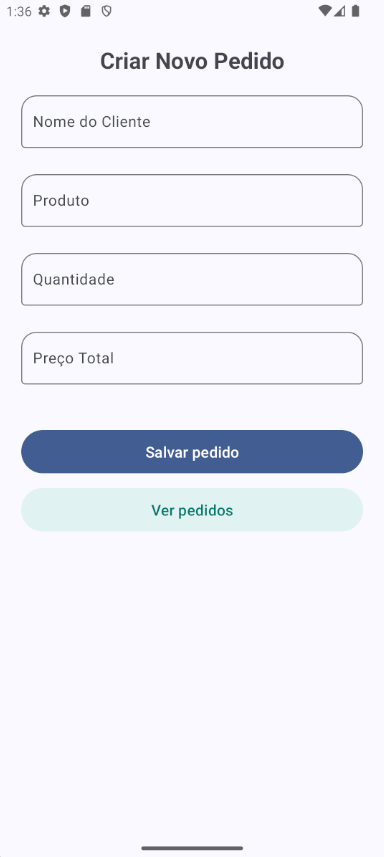
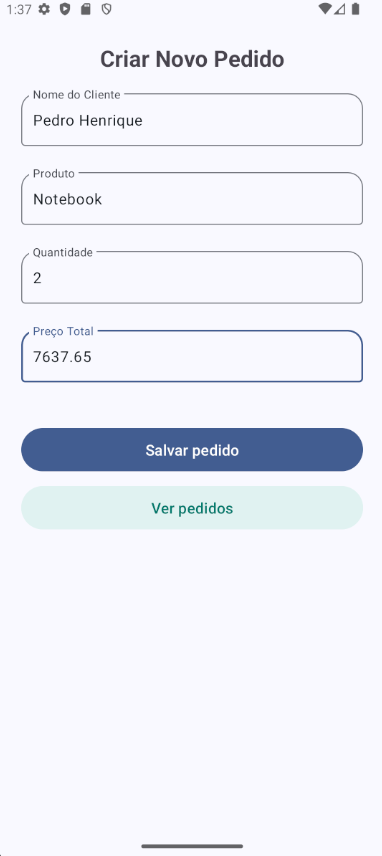
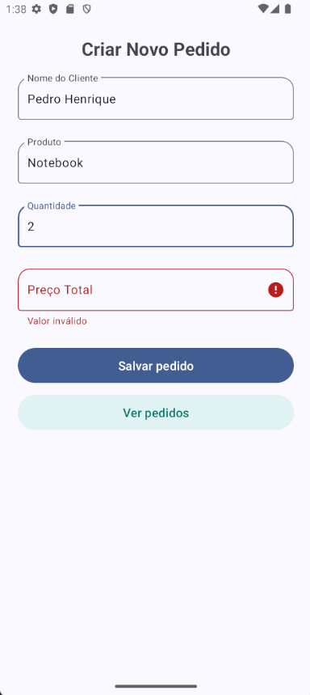
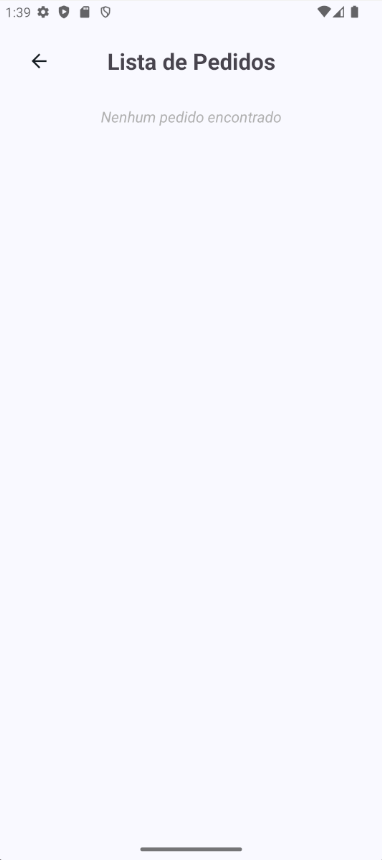

<h1 align="center">PDV APP - Lançamento de Pedidos</h1>

  
  
  

  
⭐ Aplicativo Android utilizando Java para o lançamento de pedidos, que se comunica com uma API desenvolvida em .NET rodando em localhost. O aplicativo permite que o usuário cadastre novos pedidos, visualize e delete os pedidos existentes.

### O aplicativo possui duas telas principais:
- #### Tela de criação de pedidos
  - Permite o usuario cadastrar um novo pedido, fazendo todas as validações dos campos.
 
- #### Tela de listagem de pedidos
  - Permite o usuário visualizar todos os pedidos cadastrados e deletar.

## Tecnologias usadas e bibliotecas de código aberto
- Jetpack
  - Navigation Component: O Navigation Component ajuda você a implementar a navegação, desde simples cliques em botões até padrões mais complexos, como barras de aplicativos e a gaveta de navegação.
  - Lifecycle: Observe os ciclos de vida do Android e manipule os estados da interface do usuário após as alterações do ciclo de vida.
  - ViewModel: Gerencia o detentor de dados relacionados à interface do usuário e o ciclo de vida. Permite que os dados sobrevivam a alterações de configuração, como   rotações de tela.

- ListAdapter:
  - A exibição da lista de pedidos é feita usando o ListAdapter, que é uma implementação de RecyclerView.Adapter otimizada. Ele usa internamente o DiffUtil para comparar e atualizar a lista de maneira eficiente,   garantindo que apenas os itens alterados sejam atualizados, melhorando o desempenho da aplicação.
  - Permite a exibição de diferentes tipos de itens na lista, como os pedidos e itens vazios, foi implementado um mecanismo de múltiplas views. Cada item da lista possui um tipo de view, determinado por um enum, que define como ele será exibido. Isso permite que diferentes tipos de dados, como pedidos ou itens vazios, sejam exibidos de maneira eficiente em uma única lista.

- Arquitetura
  - MVVM (View - ViewModel - Model) com Clean Architecture
  - Comunicação da ViewModel com a View através de LiveData
  - Comunicação da ViewModel com o model através de UseCases
  - Repositories para abstração da comunicação com a camada de dados.
  - Injeção de dependência com Hilt.

 

## Features

### Criação de pedidos

  
  
  

### Listagem de pedidos

  
  
  

